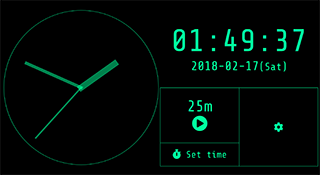

# Clock

[](https://travis-ci.org/ginpei/giclock)
[](https://greenkeeper.io/)

An analog and digital clock with "pomodoro" timer.

- App https://clock.ginpei.info/
- Codes https://github.com/ginpei/giclock/



# Built with ...

## Libraries and frameworks

- [Vue.js](https://vuejs.org/) + [Nuxt.js](https://nuxtjs.org/) (new)
- Nuxt.js' [PWA Module](https://github.com/nuxt-community/pwa-module) (new) + [Workbox](https://developers.google.com/web/tools/workbox/) (new)
- [Pug](https://pugjs.org/api/getting-started.html)
- [Sass](https://sass-lang.com/)

## Tools

- [ESLint](https://eslint.org/) + [JavaScript Standard Style](https://standardjs.com/)
- [EditorConfig](http://editorconfig.org/)
- [Mocha](https://mochajs.org/) + [Chai](http://chaijs.com/) + [SinonJS](http://sinonjs.org/)
- [push-dir](https://github.com/L33T-KR3W/push-dir) (new)
- [yarn](https://yarnpkg.com/)
- [vue-cli](https://github.com/vuejs/vue-cli) (new)
- [Visual Studio Code](https://code.visualstudio.com/) (new)

## Web standard APIs

- [Web App Manifest](https://developer.mozilla.org/en-US/docs/Web/Manifest) in order for [PWA](https://developer.mozilla.org/en-US/Apps/Progressive)
- [CSS Grid Layout](https://developer.mozilla.org/en-US/docs/Web/CSS/CSS_Grid_Layout) (new)
- [async function](https://developer.mozilla.org/en-US/docs/Web/JavaScript/Reference/Statements/async_function) from ES2017

## Services

- [Travis CI](https://travis-ci.org/)
- [Greenkeeper](https://greenkeeper.io/)
- [Git](https://git-scm.com/) + [GitHub](https://github.com/)
- [GitHub Pages](https://pages.github.com/)
- [CloudFlare](https://www.cloudflare.com/) (new)

# Development

```console
$ yarn install
$ npm run dev
```

## Publish latest codes to GitHub Pages (`gh-pages`)

```console
$ npm run publish
```

# Contact

- Ginpei Takanashi
- https://ginpei.info
